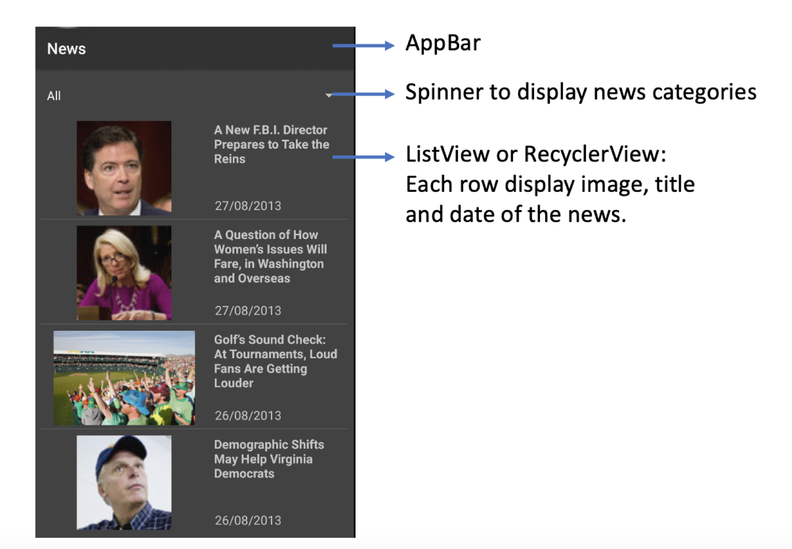
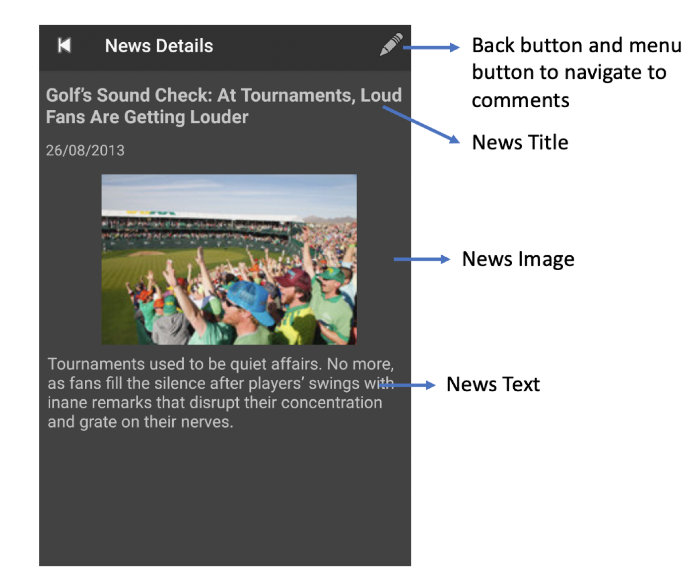
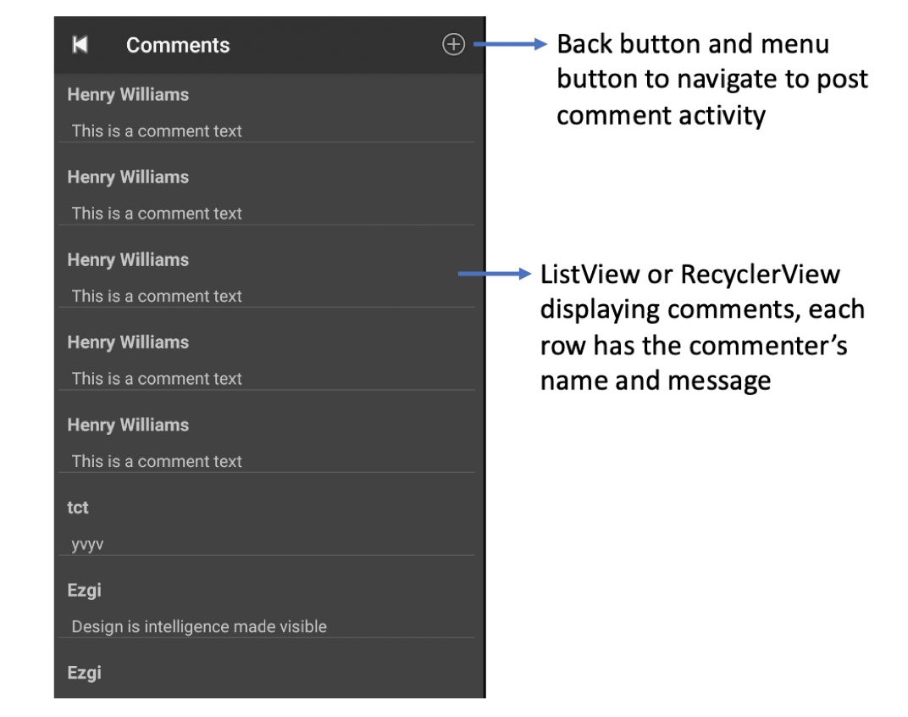
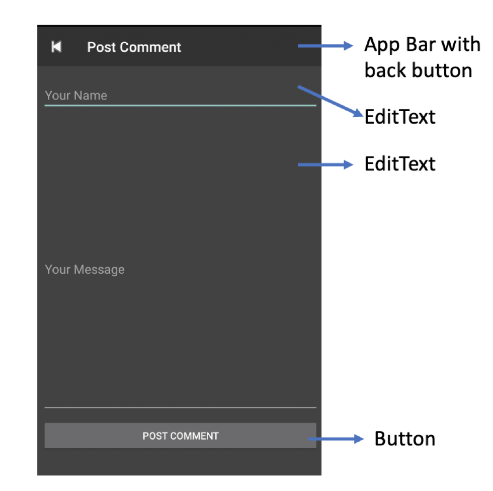

# NewsApplication

This application take the data from the news agency’s restful web service. 

## How The Application Works
There are 4 activities for the main page, details of news, comment page for each news, and comment creation. There is a spinner for filtering the news by their categories(Politics, Sports and Economics). When we clicked news it will open the page which contains the detail of that news. At the news detail page when we clicked the pencil logo it will open the comments page in which we can see all the other users' comments. At the comments page we can choose plus icon it will open the comment creation page and we can add our name and comment on that page and we can post it. All the pages except the main page have got back arrow icons to navigate on pages.
All the pages except main page have got back arrow icon to navigate on pages.

## Main Page

## Details of News

## Comments

## Comments Creation

